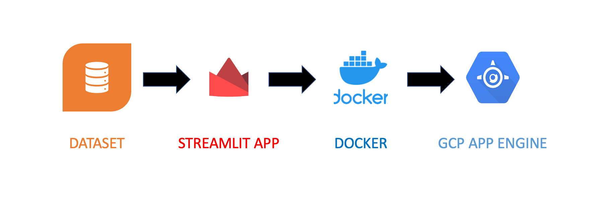
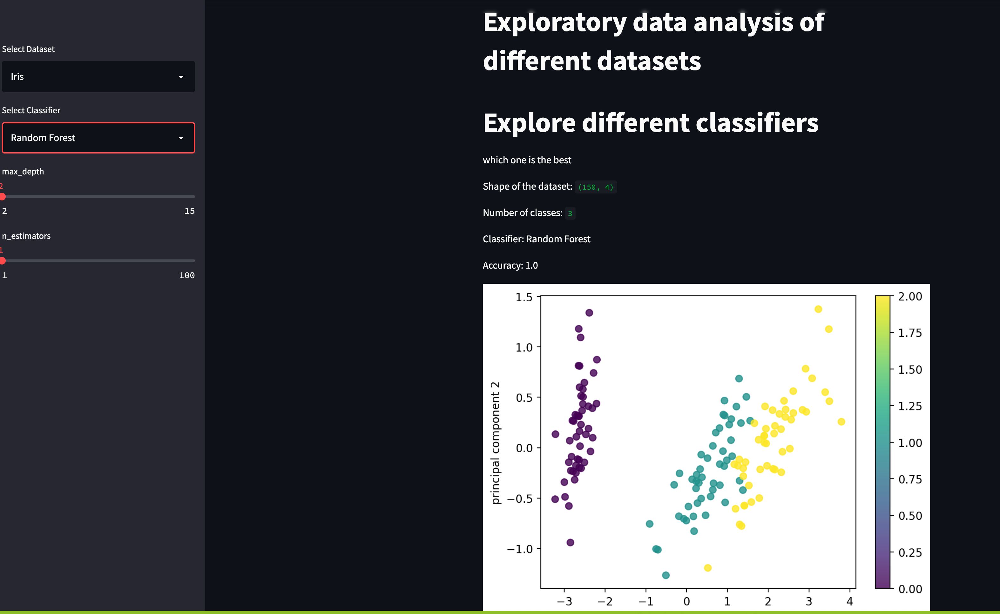

# No Code Data Analytics Platform

#### Team Members: Abhilash Sarnad, Christine Park, Hearsch Jariwala

## Cloud Architecture 



## Streamlit Interface


The demo app allows the user to analyze different datasets, model them using different machine learning models and tune the hyperparameters by providing an interactive UI and generates interactive graphs. The app can be run locally, and can also be deployed on the Google Cloud Platform via the Google App Engine.


## Run the app locally

Execute the following command to run the demo app locally:
```
streamlit run app.py --server.port=8080 --server.address=0.0.0.0
```
which starts our Streamlit app and serves it so that it is avaiable to access from the browser.

### Run the app locally within a Docker container
Enter `make run-container` in make file, it triggers the commands within the `run-container` section of the Makefile.  The commands which are triggered are:
```
docker build . -t app.py
docker run -p 8080:8080 app.py
```
The first command builds the Docker container for the app, and the second command then runs the app within the Docker container and serves it so that it is accessible from our browser.

## Deploy the app on Google App Engine

To deploy the app on GCP, do the following:  
1) In the Makefile, under the 'gcloud-deploy' section change the GCP project name:
    ```
    gcloud config set project No-code-data-analytics
    ```
    This sets the active project in the gcloud CLI so that you deploy the app to the correct GCP project.  

2) Now, enter `make gcloud-deploy` from the command line.  This will deploy 
   the app via Google App Engine (GAE), and the process may take several 
   minutes.  It may ask you to authenticate with GCP if you are not already authenticated.


When we run `make gcloud-deploy`, we execute the following commands via the Makefile:  
```
gcloud config set project No-Code-Data-Analytics
gcloud app deploy app.yaml --stop-previous-version
```

The first command sets our GCP project.  The second command deploys our app via Google App Engine according to the 'app.yaml' file.  This process consists of the following steps:
1) A Docker container is created for our app, defined by the Dockerfile within our directory 
2) Once the Docker container is created it becomes a Docker image, which you can think of as an immutable Docker container which we can deploy anywhere and it will not change.
3) The Docker image is uploaded to the Google Container Registry (GCR)
4) When the Docker container is available on GCR, it is then deployed to a Google App Engine instance, which is defined by the instructions in the 'app.yaml' file:
    ```
    runtime: custom
    env: flex
    ```
    Because we are using Streamlit, we need to specify a custom runtime and flexible environment for our app.

After completion of the above steps, the app will now be live on GCP!  
The app can be accessed at the following url:
```
https://No-Code-Data-Analytics.ue.r.appspot.com/
```


